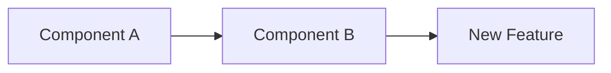

# Create Comprehensive Pull Request

You are tasked with creating a detailed and comprehensive pull request that provides maximum context to reviewers. Analyze all commits, code changes, and generate a structured PR description that helps reviewers understand the changes at a glance.

## Step 1: Identify Context and Base Branch

Determine the current branch and base branch for comparison:

!git branch --show-current
!git remote get-url origin 2>/dev/null || echo "No remote origin"

# Find the base branch (main or master)
!git rev-parse --verify main >/dev/null 2>&1 && echo "BASE_BRANCH=main" || (git rev-parse --verify master >/dev/null 2>&1 && echo "BASE_BRANCH=master" || echo "BASE_BRANCH=HEAD~10")

## Step 2: Analyze Commits and Changes

Gather comprehensive information about all commits in this PR:

# Get merge base and commit range
!BASE=$(git rev-parse --verify main >/dev/null 2>&1 && echo "main" || (git rev-parse --verify master >/dev/null 2>&1 && echo "master" || echo "HEAD~10")); git merge-base HEAD $BASE 2>/dev/null || echo "No merge base found"

# List commits with full details
!BASE=$(git rev-parse --verify main >/dev/null 2>&1 && echo "main" || (git rev-parse --verify master >/dev/null 2>&1 && echo "master" || echo "HEAD~10")); git log --pretty=format:"COMMIT: %H%nAUTHOR: %an <%ae>%nDATE: %ad%nSUBJECT: %s%nBODY: %b%n---" $BASE..HEAD 2>/dev/null

## Step 3: Analyze Code Changes

Get comprehensive diff information:

# File statistics and change summary
!BASE=$(git rev-parse --verify main >/dev/null 2>&1 && echo "main" || (git rev-parse --verify master >/dev/null 2>&1 && echo "master" || echo "HEAD~10")); git diff $BASE...HEAD --stat

# File-level changes (Added/Modified/Deleted)
!BASE=$(git rev-parse --verify main >/dev/null 2>&1 && echo "main" || (git rev-parse --verify master >/dev/null 2>&1 && echo "master" || echo "HEAD~10")); git diff $BASE...HEAD --name-status

## Step 4: Determine PR Description Language

Analyze context to determine the appropriate language for PR description:

# 1. Check recent PR/commit messages language preference
!BASE=$(git rev-parse --verify main >/dev/null 2>&1 && echo "main" || (git rev-parse --verify master >/dev/null 2>&1 && echo "master" || echo "HEAD~10")); git log --oneline $BASE..HEAD | head -10

# 2. Check for .github PR template language
![ -f .github/pull_request_template.md ] && head -20 .github/pull_request_template.md 2>/dev/null || echo "No PR template found"

# 3. Check main README language as project indicator
![ -f README.md ] && head -30 README.md | tail -20 2>/dev/null || echo "No README found"

# 4. Analyze team's recent merged PRs (if using gh CLI)
!gh pr list --state merged --limit 5 --json title,body --jq '.[].title' 2>/dev/null || echo "Unable to fetch recent PRs"

Based on the above context:
- If PR template exists, follow its language
- If recent commits/PRs are predominantly in a specific language, use that
- If mixed or unclear, default to English for international collaboration

## Step 5: Check Test Coverage in PR

Identify test files modified in this PR:

# Check for test file changes in the PR
!BASE=$(git rev-parse --verify main >/dev/null 2>&1 && echo "main" || (git rev-parse --verify master >/dev/null 2>&1 && echo "master" || echo "HEAD~10")); git diff $BASE...HEAD --name-only | grep -E '(test|spec)\.(js|ts|py|rb|go|java|cpp|c)$|\.(test|spec)\.(js|ts|jsx|tsx)$|_test\.(go|py)$|Test\.(java|cs)$' 2>/dev/null || echo "No test file changes in this PR"

# Check if tests were run
![ -f package.json ] && grep -q '"test"' package.json && echo "Test script available - remind reviewer to verify tests" || echo "No test configuration detected"

## Step 6: Generate PR Content

Based on the gathered information, create a comprehensive pull request with the following structure:

1. **Determine Target Branch**: Use $ARGUMENTS if provided, otherwise use the default branch (main or master)

2. **Language Selection Strategy**:
   - **Primary**: Follow the language of existing PR template if present
   - **Secondary**: Match the language used in recent team PRs/commits
   - **Tertiary**: Use the primary language of project documentation
   - **Default**: Use English for broader accessibility
   - **Note**: Maintain consistency with team's communication patterns

3. **PR Title Format**:
   - Use conventional commit format if detected in recent commits
   - Otherwise: "[Type] Brief description of changes"
   - Types: feat, fix, docs, style, refactor, perf, test, chore

4. **PR Body Structure**:

```markdown
## 📋 Summary
[2-3 sentences providing high-level overview of what this PR accomplishes]

## 🎯 Purpose & Context
[Explain WHY these changes are being made]
- Problem being solved
- Business/Technical context
- Related issues or discussions

## 📝 Detailed Changes

### [Component/Module Name]
- **What changed**: [Specific changes made]
- **Why**: [Reasoning behind the change]
- **Impact**: [How this affects the system]

[Repeat for each major component]

## 🔧 Technical Implementation

### Architecture Changes
[If applicable, include mermaid diagrams]



### Key Technical Decisions
1. [Decision 1]: [Rationale]
2. [Decision 2]: [Rationale]

### Code Structure
- New files added: [List with purpose]
- Modified files: [List with type of modification]
- Deleted files: [If any, with reason]

## 🧪 Testing

### Test Coverage
- [ ] Unit tests added/updated
- [ ] Integration tests added/updated
- [ ] Manual testing completed

### Testing Instructions
1. [Step-by-step instructions for reviewers to test]
2. [Include any necessary setup or data]

### Test Results
[Summary of test results or screenshots if applicable]

## 📊 Performance Impact
[If applicable]
- Benchmarks before/after
- Memory usage changes
- Load time improvements

## 🚀 Deployment Notes
- [ ] Database migrations required
- [ ] Environment variables added/changed
- [ ] Configuration changes needed
- [ ] Breaking changes

## 📸 Screenshots/Recordings
[If UI changes, include before/after screenshots]

## ✅ Checklist
- [ ] Code follows project style guidelines
- [ ] Self-review completed
- [ ] Comments added for complex logic
- [ ] Documentation updated
- [ ] No console.log or debug code left
- [ ] All tests passing
- [ ] Considered edge cases
- [ ] Backwards compatibility maintained

## 🔗 Related Links
- Related Issue: #[issue-number]
- Documentation: [link]
- Design Doc: [link]

## 👥 Reviewers Guide
[Special notes for reviewers]
- Focus areas for review
- Potential concerns or trade-offs
- Questions for discussion

---
🤖 Generated with [Claude Code](https://claude.ai/code)
```

5. **Include Diagrams When Applicable**:
   - For architectural changes, use mermaid flowcharts
   - For state changes, use state diagrams
   - For database changes, use ER diagrams
   - For API changes, use sequence diagrams

6. **Create the PR**:
   - Ensure branch is pushed: `git push -u origin HEAD`
   - Use `gh pr create --title "[Title]" --body "[Body]" --base [target-branch]`
   - Auto-detect and set labels based on commit types (feat→enhancement, fix→bug, etc.)
   - Auto-assign reviewers from CODEOWNERS if available
   - Add draft flag if WIP or incomplete: `--draft`

## Step 7: Create the Pull Request

Execute PR creation with the generated content:

1. Ensure all uncommitted changes are handled
2. Push the current branch if needed:
   !git push -u origin HEAD 2>/dev/null || echo "Branch already pushed or no remote configured"

3. Create PR using gh CLI with the generated title and body
4. Return the PR URL to the user

**Key Principles:**
- Provide comprehensive context without overwhelming reviewers
- Use the appropriate language based on team/project conventions
- Include all relevant technical details and testing information
- Make it easy for reviewers to understand the impact and test the changes