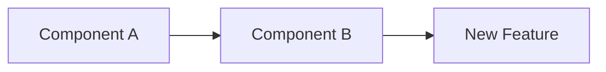

# Create Comprehensive Pull Request

You are tasked with creating a detailed and comprehensive pull request that provides maximum context to reviewers. Analyze all commits, code changes, and generate a structured PR description that helps reviewers understand the changes at a glance.

## Step 1: Gather Git Information

First, collect all necessary git information:

!git status --porcelain
!git branch --show-current
!git remote get-url origin 2>/dev/null || echo "No remote origin"
!git log --oneline -20
!git diff --stat HEAD~1..HEAD 2>/dev/null || git diff --stat main...HEAD 2>/dev/null || git diff --stat master...HEAD 2>/dev/null

## Step 2: Analyze Branch Divergence

Determine the base branch and analyze all commits since divergence:

!git merge-base HEAD main 2>/dev/null || git merge-base HEAD master 2>/dev/null || echo "No merge base found"
!git log --pretty=format:"%h - %an, %ar : %s" main..HEAD 2>/dev/null || git log --pretty=format:"%h - %an, %ar : %s" master..HEAD 2>/dev/null || git log --pretty=format:"%h - %an, %ar : %s" HEAD~10..HEAD

## Step 3: Detailed Commit Analysis

Get detailed commit information including full messages and changes:

!git log --pretty=format:"COMMIT: %H%nAUTHOR: %an <%ae>%nDATE: %ad%nSUBJECT: %s%nBODY: %b%n---" main..HEAD 2>/dev/null || git log --pretty=format:"COMMIT: %H%nAUTHOR: %an <%ae>%nDATE: %ad%nSUBJECT: %s%nBODY: %b%n---" master..HEAD 2>/dev/null

## Step 4: Analyze Code Changes

Get comprehensive diff information:

!git diff main...HEAD --stat 2>/dev/null || git diff master...HEAD --stat 2>/dev/null || git diff HEAD~5..HEAD --stat
!git diff main...HEAD --name-status 2>/dev/null || git diff master...HEAD --name-status 2>/dev/null

## Step 5: Determine Project Language

Analyze the project to determine the primary language for PR description:

!find . -type f -name "*.md" -o -name "*.txt" -o -name "README*" | head -5 | xargs grep -l "한글\|Korean\|한국" 2>/dev/null | head -1
!git log --oneline -10 | grep -E "(한글|Korean|한국|docs:|chore:|feat:|fix:)" | head -5

## Step 6: Check for Test Files

Identify test coverage:

!find . -type f \( -name "*test*" -o -name "*spec*" \) -newer .git/index 2>/dev/null | head -10 || echo "No recent test changes"

## Instructions for PR Creation

Based on the gathered information, create a comprehensive pull request with the following structure:

1. **Determine Target Branch**: Use $ARGUMENTS if provided, otherwise use the default branch (main or master)

2. **Language Selection**: 
   - Check commit messages, documentation, and code comments
   - If Korean indicators are found, write in Korean
   - Otherwise, write in English

3. **PR Title Format**:
   - Use conventional commit format if detected in recent commits
   - Otherwise: "[Type] Brief description of changes"
   - Types: feat, fix, docs, style, refactor, perf, test, chore

4. **PR Body Structure**:

```markdown
## 📋 Summary
[2-3 sentences providing high-level overview of what this PR accomplishes]

## 🎯 Purpose & Context
[Explain WHY these changes are being made]
- Problem being solved
- Business/Technical context
- Related issues or discussions

## 📝 Detailed Changes

### [Component/Module Name]
- **What changed**: [Specific changes made]
- **Why**: [Reasoning behind the change]
- **Impact**: [How this affects the system]

[Repeat for each major component]

## 🔧 Technical Implementation

### Architecture Changes
[If applicable, include mermaid diagrams]



### Key Technical Decisions
1. [Decision 1]: [Rationale]
2. [Decision 2]: [Rationale]

### Code Structure
- New files added: [List with purpose]
- Modified files: [List with type of modification]
- Deleted files: [If any, with reason]

## 🧪 Testing

### Test Coverage
- [ ] Unit tests added/updated
- [ ] Integration tests added/updated
- [ ] Manual testing completed

### Testing Instructions
1. [Step-by-step instructions for reviewers to test]
2. [Include any necessary setup or data]

### Test Results
[Summary of test results or screenshots if applicable]

## 📊 Performance Impact
[If applicable]
- Benchmarks before/after
- Memory usage changes
- Load time improvements

## 🚀 Deployment Notes
- [ ] Database migrations required
- [ ] Environment variables added/changed
- [ ] Configuration changes needed
- [ ] Breaking changes

## 📸 Screenshots/Recordings
[If UI changes, include before/after screenshots]

## ✅ Checklist
- [ ] Code follows project style guidelines
- [ ] Self-review completed
- [ ] Comments added for complex logic
- [ ] Documentation updated
- [ ] No console.log or debug code left
- [ ] All tests passing
- [ ] Considered edge cases
- [ ] Backwards compatibility maintained

## 🔗 Related Links
- Related Issue: #[issue-number]
- Documentation: [link]
- Design Doc: [link]

## 👥 Reviewers Guide
[Special notes for reviewers]
- Focus areas for review
- Potential concerns or trade-offs
- Questions for discussion

---
🤖 Generated with [Claude Code](https://claude.ai/code)
```

5. **Include Diagrams When Applicable**:
   - For architectural changes, use mermaid flowcharts
   - For state changes, use state diagrams
   - For database changes, use ER diagrams
   - For API changes, use sequence diagrams

6. **Create the PR**:
   - Use `gh pr create` with the generated title and body
   - Set appropriate labels if detected from commit types
   - Request reviewers if specified in CODEOWNERS

## Final Steps

After generating the comprehensive PR description:

1. Review all sections and ensure completeness
2. Add any project-specific sections if needed
3. Create the PR using gh CLI
4. Return the PR URL to the user

Remember: The goal is to provide reviewers with all the context they need to understand and review the changes effectively without having to dig through commits or ask clarifying questions.