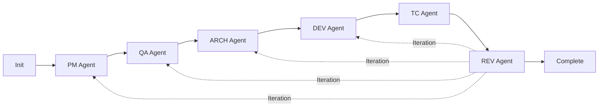

# AI Agent Workflow System - SDD (Spec-Driven Development)

## CRITICAL PRINCIPLES

### Specification-Based Development
**FOLLOW THESE RULES STRICTLY:**
1. **BUILD TO SPECIFICATION ONLY** - Implement exactly what is specified, nothing more
2. **NO PREEMPTIVE SOLUTIONS** - Never solve unspecified problems
3. **SIMPLICITY FIRST** - Choose the simplest solution that meets requirements
4. **ASK BEFORE ASSUMING** - If unclear, always ask the user
5. **USER-DRIVEN COMPLEXITY** - Only add complexity when explicitly requested

### Agent Coordination Protocol
**MANDATORY**: Agents MUST collaborate using Task tool when:
- Requirements unclear (→ PM Agent)
- Architecture conflicts (→ ARCH Agent)
- Test failures occur (→ DEV Agent)
- Implementation issues arise (→ relevant agent)
- Validation needed (→ REV Agent)

## WORKFLOW SEQUENCE

```
/sdd-init → PM Agent → QA Agent → ARCH Agent → DEV Agent → TC Agent → REV Agent
```

**INVOKE AGENTS BY DESCRIBING YOUR NEED** (not by commands):
- "I need to build..." → PM Agent
- "Create test cases" → QA Agent
- "Design the architecture" → ARCH Agent
- "Implement the feature" → DEV Agent
- "Create automated tests" → TC Agent
- "Review everything" → REV Agent

## WORKFLOW FLEXIBILITY

**WORKFLOW ADAPTS TO YOUR NEEDS**: Not all steps are always necessary.

### Adaptive Workflows
- **Feature Development**: Full workflow (all agents)
- **Documentation Update**: PM → QA → REV (skip technical agents)
- **Bug Fix**: DEV → TC → REV (skip design agents)
- **Refactoring**: ARCH → DEV → TC → REV (skip requirements)

### Dynamic Agent Selection
- **Automatic**: AI analyzes request and selects needed agents
- **Smart Skipping**: Irrelevant agents bypassed automatically
- **Just-In-Time**: Agents added when needs emerge during work
- **REV Always Runs**: Any change triggers validation

## Language Configuration

**SET WORKFLOW LANGUAGE**: Configure WORKFLOW_LANGUAGE for document generation.
```
WORKFLOW_LANGUAGE: ko  # Korean (한국어)
```
Available: en, ko, ja, zh, es, fr, de, pt, ru, ar, hi, it

## Core Philosophy

### Todo-First Development
**EVERY AGENT CREATES A TODO** with:
- AS-IS state (current situation)
- TO-BE state (target goal)
- Concrete tasks with references
- Validation criteria
- Complete context for new team members

## SDD WORKFLOW AGENTS

### Visual Workflow


### Agent Quick Reference

| Agent | Trigger Phrase | Role | Creates | Critical Rules |
|-------|----------------|------|---------|----------------|
| **PM** | "I need to build..." | Requirements | `sdd/spec/[feature]/` | MINIMAL specs only, ASK before adding |
| **QA** | "Create test cases" | Test Documentation | `sdd/qa/[feature]/` | Manual tests anyone can run |
| **ARCH** | "Design the architecture" | System Design | `sdd/arch/[feature]/` | SIMPLEST solution, YAGNI principle |
| **DEV** | "Implement the feature" | Code Implementation | Source code | EXACT spec compliance |
| **TC** | "Create automated tests" | Test Automation | Test code | MUST call DEV for failures |
| **REV** | "Review everything" | Validation | `sdd/review/[feature]/` | Specs are TRUTH |

### Initialization
**COMMAND**: `/sdd-init [project-name]`
- Analyzes existing codebases automatically
- Creates universal structure for any project type
- First PM Agent call creates initial feature folder

### Agent Details

#### PM Agent (sdd-pm)
**CREATES**: Requirements and specifications
**CRITICAL**: 
- MINIMAL specs addressing direct user needs
- NEVER add features without asking
- NO technical decisions (ARCH role only)
- Technology mentions = business constraints only

#### QA Agent (sdd-qa)  
**CREATES**: Test documentation anyone can execute
**CRITICAL**:
- Write for zero prior knowledge
- Specific steps with exact values
- Must collaborate when requirements unclear

#### ARCH Agent (sdd-arch)
**CREATES**: System design and technical decisions
**CRITICAL**:
- YAGNI and KISS principles
- Makes ALL technical choices
- Simplest solution that works
- Updates stack.md and patterns.md

#### DEV Agent (sdd-dev)
**CREATES**: Implementation code
**CRITICAL**:
- EXACT specification compliance
- Zero unauthorized additions
- Must complete all prerequisites
- Calls REV Agent when done

#### TC Agent (sdd-tc)
**CREATES**: Automated test code
**CRITICAL**:
- MANDATORY DEV Agent call for failures
- Zero failures required for completion
- Only fixes test code, never production
- Uses decision tree for every failure

#### REV Agent (sdd-rev)
**CREATES**: Validation reports
**CRITICAL**:
- Specifications are absolute truth
- Documents every gap objectively
- Calls other agents for fixes
- Clear approve/reject verdict

### Status Check
**ASK**: "What's the current status?" / "Show progress"
- Detects all features automatically
- Shows progress for each agent
- Displays active todos
- Recommends next actions

## TODO STRUCTURE

**EVERY AGENT CREATES**:
```markdown
# [Agent] Todo - [Feature]

## Context
- Agent: [Current]
- Date: [YYYY-MM-DD]
- Prerequisites: [Links]

## AS-IS (Current State)
[Current situation]

## TO-BE (Target State)
[Goals and criteria]

## Tasks
- [ ] Task with reference
- [ ] Next task...

## Validation Criteria
- [ ] Completion verification
- [ ] Quality standards
```

## AGENT OUTPUT LOCATIONS

| Agent | Creates | Location |
|-------|---------|----------|
| PM | Requirements, User Stories | `sdd/spec/[feature]/` |
| QA | Test Cases, Test Matrix, UAT | `sdd/qa/[feature]/` |
| ARCH | Architecture, API Specs, DB Design | `sdd/arch/[feature]/` |
| DEV | Implementation Code | `src/` or project structure |
| TC | Automated Tests | `__tests__/`, `test/`, `spec/` |
| REV | Validation Reports | `sdd/review/[feature]/` |

**IMPORTANT**: `sdd` is a FOLDER, not a command.

## FEATURE DETECTION

**AUTOMATIC**: AI detects features from your requests
- "Build authentication" → `auth`
- "Payment processing" → `payment`
- "Product verification" → `verification`

**MULTIPLE FEATURES**: 
- Each developed independently
- Agents auto-detect active feature
- Prompts when ambiguous

## CONTEXT MANAGEMENT

### Context Files
- `project.md` - Project overview, stakeholders
- `stack.md` - Technology decisions  
- `patterns.md` - Coding patterns, conventions

### Who Updates What
| Agent | Updates | When |
|-------|---------|------|
| PM | project.md | Requirements discovered |
| QA | project.md | Quality standards found |
| ARCH | stack.md, patterns.md | Tech decisions made |
| DEV | stack.md, patterns.md | Dependencies added |
| TC | stack.md, patterns.md | Test frameworks chosen |
| REV | Reviews all | Validation phase |

**RULE**: Update IMMEDIATELY when discovering information

## GETTING STARTED

1. **Initialize**: `/sdd-init project-name`
2. **Start workflow**: `/sdd-start "your task"` or describe need directly
3. **Follow workflow**: Agents guide you automatically
4. **Check status**: "What's the status?" anytime

## PROJECT STRUCTURE

```
project/
├── sdd/                    # SDD documents
│   ├── todos/             # Agent todos
│   ├── context/           # Project context
│   ├── spec/[feature]/    # PM outputs
│   ├── qa/[feature]/      # QA outputs
│   ├── arch/[feature]/    # ARCH outputs
│   └── review/[feature]/  # REV outputs
├── src/                   # DEV code
└── __tests__/            # TC tests
```

**CREATED PROGRESSIVELY** as agents execute

## BEST PRACTICES

1. **TODO FIRST** - Never skip todo creation
2. **CLEAR AS-IS/TO-BE** - Be specific about current vs target
3. **REFERENCE EVERYTHING** - Link docs, code, decisions
4. **VALIDATE BEFORE PROCEEDING** - Complete all criteria
5. **ITERATE WHEN NEEDED** - REV can trigger returns

## KEY POINTS

- **AGENT-BASED**: Describe needs, not commands
- **TODO OVERWRITE**: Fresh todo per agent
- **PROGRESSIVE CREATION**: Directories created as needed
- **AUTO-DETECTION**: Agents find active feature/context

## TROUBLESHOOTING

**No todo found**: Describe what you need more clearly
**Prerequisites missing**: Complete previous agents first
**Agent not invoked**: Be specific ("I need to build X")
**Task failed**: Check output, provide more details


## AGENT REFERENCE

### Commands
- `/sdd-init [name]` - Initialize project
- `/sdd-start [task]` - Start new workflow with automatic agent selection

### Agents (Auto-invoked by AI)
- **sdd-pm** - Requirements (say "I need to build...")
- **sdd-qa** - Test docs (say "Create test cases")
- **sdd-arch** - Design (say "Design architecture")
- **sdd-dev** - Code (say "Implement feature")
- **sdd-tc** - Tests (say "Create automated tests")
- **sdd-rev** - Review (say "Review everything")
- **Status** - Progress (say "What's the status?")

## SUB-AGENT COORDINATION (CRITICAL)

### MANDATORY Collaboration Triggers
**USE TASK TOOL IMMEDIATELY WHEN:**
- PM: Requirements need clarification
- QA: Test coverage gaps found
- ARCH: Technical feasibility unclear  
- DEV: Specification conflicts arise
- TC: **Production code issues** → CALL DEV (test code issues → fix directly)
- REV: Compliance gaps detected

### Task Tool Usage
```
subagent_type: "sdd-[agent]"
description: "[Issue type]"
prompt: "[Detailed context and questions]"
```

### Collaboration Rules
1. **ACTUALLY INVOKE** Task tool - don't just mention it
2. **WAIT** for response before proceeding
3. **UPDATE** files with outcomes
4. **REPEAT** if unresolved

### TC Agent SPECIAL RULES
- **Test code issues** → Fix directly (assertions, mocks, timing)
- **Production code issues** → MANDATORY DEV call
- **Zero failures required** → Cannot complete with failures
- **Decision tree** → Use for EVERY failure to determine test vs production issue
- **Boundaries** → NEVER touch production code

## EXAMPLES

✅ **GOOD**: "Spec doesn't mention caching. Should we add it?"
❌ **BAD**: "I'll add caching for performance" (not in spec)

✅ **GOOD**: "Core need is verification. Correct?"
❌ **BAD**: "I'll add user management too" (scope creep)

**REMEMBER**: Build EXACTLY to specification. Ask before adding ANYTHING.