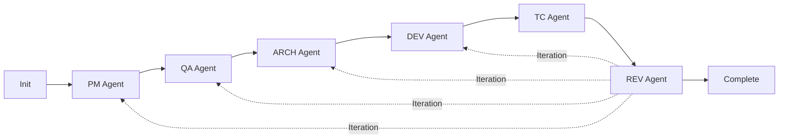

# AI Agent Workflow System - SDD (Spec-Driven Development)

## CRITICAL PRINCIPLES

### Specification-Based Development
**FOLLOW THESE RULES STRICTLY:**
1. **BUILD TO SPECIFICATION ONLY** - Implement exactly what is specified, nothing more
2. **NO PREEMPTIVE SOLUTIONS** - Never solve unspecified problems
3. **SIMPLICITY FIRST** - Choose the simplest solution that meets requirements
4. **ASK BEFORE ASSUMING** - If unclear, always ask the user
5. **USER-DRIVEN COMPLEXITY** - Only add complexity when explicitly requested

### Agent Boundary Rules
**MANDATORY BOUNDARY ENFORCEMENT:**
1. **ROLE BOUNDARIES ARE ABSOLUTE** - Each agent MUST operate within defined scope
2. **IMMEDIATE STOP ON MISMATCH** - Stop work if task doesn't match agent role
3. **REPORT BOUNDARY VIOLATIONS** - Clearly explain why task is outside scope
4. **NO CROSS-ROLE WORK** - Never do another agent's job
5. **INTELLIGENT TASK ROUTING** - Recommend correct agent for mismatched tasks
6. **SELF-TERMINATE WHEN APPROPRIATE** - Skip work with no value to add
7. **DOCUMENT CONSERVATIVELY** - Only create docs new team members need

### Agent Coordination Protocol
**MANDATORY**: Agents MUST collaborate using Task tool when:
- Requirements unclear (→ PM Agent)
- Architecture conflicts (→ ARCH Agent)
- Test failures occur (→ DEV Agent)
- Implementation issues arise (→ relevant agent)
- Validation needed (→ REV Agent)

## WORKFLOW SEQUENCE

```
/sdd-init → PM Agent → QA Agent → ARCH Agent → DEV Agent → TC Agent → REV Agent
```

**INVOKE AGENTS BY DESCRIBING YOUR NEED** (not by commands):
- "I need to build..." → PM Agent
- "Create test cases" → QA Agent
- "Design the architecture" → ARCH Agent
- "Implement the feature" → DEV Agent
- "Create automated tests" → TC Agent
- "Review everything" → REV Agent

## WORKFLOW FLEXIBILITY

**WORKFLOW ADAPTS TO YOUR NEEDS**: Not all steps are always necessary.

### Adaptive Workflows
- **Feature Development**: Full workflow (all agents)
- **Documentation Update**: PM → QA → REV (skip technical agents)
- **Bug Fix**: DEV → TC → REV (skip design agents)
- **Refactoring**: ARCH → DEV → TC → REV (skip requirements)
- **Configuration/Setup**: DEV → REV (minimal workflow)
- **Tool/Version Updates**: DEV → TC → REV (skip non-technical agents)

### Dynamic Agent Selection
- **Automatic**: AI analyzes request and selects needed agents
- **Smart Skipping**: Irrelevant agents bypassed automatically
- **Just-In-Time**: Agents added when needs emerge during work
- **REV Always Runs**: Any change triggers validation

### Request Analysis Rules
- **Technical-only tasks**: Skip PM/QA for pure implementation
- **No user impact**: Skip QA for internal changes
- **Clear specifications**: Skip PM if requirements obvious
- **Simple changes**: Minimize workflow to essential agents

## Language Configuration

**SET WORKFLOW LANGUAGE**: Configure WORKFLOW_LANGUAGE for document generation.
```
WORKFLOW_LANGUAGE: ko  # Korean (한국어)
```
Available: en, ko, ja, zh, es, fr, de, pt, ru, ar, hi, it

### How Language Setting Works
**AGENTS MUST**:
1. **READ** this CLAUDE.md file at the start of each task
2. **FIND** the WORKFLOW_LANGUAGE setting (line 73)
3. **GENERATE** all documents in the specified language
4. **KEEP** code, file paths, and technical terms in English

### Language Application Examples
**Korean (ko) Example**:
- Document titles: `# 요구사항 문서` not `# Requirements Document`
- Section headers: `## 핵심 기능` not `## Core Features`
- Content: Korean descriptions with English technical terms
- Code comments: Keep in English for maintainability

**Document Structure (Korean)**:
```markdown
# 요구사항 문서 - 사용자 인증  # Korean title

## 비즈니스 요구사항         # Korean headers
- 사용자는 email로 로그인    # Korean content
- JWT token 발급 필요        # English technical terms
- session은 24시간 유지      # Mixed language OK

## 기술 제약사항
- Framework: Express.js      # Keep technical specs in English
- Database: PostgreSQL       # Keep product names in English
```

**CRITICAL**: Language setting affects ALL agent-generated documents:
- Todo files (`sdd/todos/`)
- Specifications (`sdd/spec/`)
- Test documentation (`sdd/qa/`)
- Architecture docs (`sdd/arch/`)
- Review reports (`sdd/review/`)

## Core Philosophy

### Conservative Documentation
**ONBOARDING TEST**: "Would a new team member need this document?"
- **YES** → Write concise, focused documentation
- **NO** → Skip documentation, information lives in code

**Documentation Smells**:
- Obvious information (version in package.json)
- Setup instructions (belongs in README)
- Configuration details (belongs in code comments)
- Empty sections "for completeness"

### Todo-First Development
**EVERY AGENT CREATES A TODO** with:
- AS-IS state (current situation)
- TO-BE state (target goal)
- Concrete tasks with references
- Validation criteria
- Complete context for new team members

**CRITICAL TODO COMPLETION RULES**:
1. **REAL-TIME TRACKING**: Use TodoWrite tool throughout work
2. **IMMEDIATE UPDATES**: Mark tasks `completed` as soon as done
3. **SINGLE FOCUS**: Only ONE task `in_progress` at a time
4. **NO ORPHANS**: All tasks must be `completed` before agent finishes
5. **PROGRESS VISIBILITY**: User sees real-time progress updates

## SDD WORKFLOW AGENTS

### Visual Workflow


### Agent Quick Reference

| Agent | Trigger Phrase | Role | Creates | Critical Rules |
|-------|----------------|------|---------|----------------|
| **PM** | "I need to build..." | Requirements | `sdd/spec/[feature]/` | MINIMAL specs only, ASK before adding |
| **QA** | "Create test cases" | Test Documentation | `sdd/qa/[feature]/` | Manual tests anyone can run |
| **ARCH** | "Design the architecture" | System Design | `sdd/arch/[feature]/` | SIMPLEST solution, YAGNI principle |
| **DEV** | "Implement the feature" | Code Implementation | Source code | EXACT spec compliance |
| **TC** | "Create automated tests" | Test Automation | Test code | MUST call DEV for failures |
| **REV** | "Review everything" | Validation + Code Quality | `sdd/review/[feature]/` | Specs are TRUTH + Quality Checks |

### Initialization
**COMMAND**: `/sdd-init [project-name]`
- Analyzes existing codebases automatically
- Creates universal structure for any project type
- First PM Agent call creates initial feature folder

### Agent Details

#### PM Agent (sdd-pm)
**CREATES**: Requirements and specifications
**CRITICAL**: 
- MINIMAL specs addressing direct user needs
- NEVER add features without asking
- NO technical decisions (ARCH role only)
- Technology mentions = business constraints only
**MUST STOP IF**:
- Task is purely technical (e.g., version updates, config changes)
- No business requirements to define
- Task already has clear specifications
- Request is for implementation only

#### QA Agent (sdd-qa)  
**CREATES**: Test documentation anyone can execute
**CRITICAL**:
- Write for zero prior knowledge
- Specific steps with exact values
- Must collaborate when requirements unclear
**MUST STOP IF**:
- Task is configuration/setup only
- No user-facing functionality to test
- Technical implementation without testable behavior
- Infrastructure changes only

#### ARCH Agent (sdd-arch)
**CREATES**: System design and technical decisions
**CRITICAL**:
- YAGNI and KISS principles
- Makes ALL technical choices
- Simplest solution that works
- Updates stack.md and patterns.md
**MUST STOP IF**:
- Simple configuration changes only
- No architectural decisions needed
- Direct implementation without design
- Tool/version updates without system impact

#### DEV Agent (sdd-dev)
**CREATES**: Implementation code
**CRITICAL**:
- EXACT specification compliance
- Zero unauthorized additions
- Must complete all prerequisites
- Calls REV Agent when done
**MUST STOP IF**:
- No specifications exist (call PM first)
- Architecture unclear (call ARCH first)
- Documentation-only changes
- Non-code deliverables

#### TC Agent (sdd-tc)
**CREATES**: Automated test code FROM QA SPECIFICATIONS ONLY
**CRITICAL**:
- ONLY implement tests documented in QA specs
- NO additional tests for "coverage" or "best practices"
- Each test MUST reference QA test case ID
- MANDATORY DEV Agent call for production failures
- Zero failures required for completion
- Only fixes test code, never production
- Uses decision tree for every failure
**MUST STOP IF**:
- No code to test
- No QA specifications exist
- Configuration-only changes
- Documentation updates only

#### REV Agent (sdd-rev)
**CREATES**: Validation reports
**CRITICAL**:
- Specifications are absolute truth
- Documents every gap objectively
- Runs static analysis (lint, type, build)
- Calls other agents for fixes
- Clear approve/reject verdict
- No approval until code quality passes
**MUST STOP IF**:
- No work completed by other agents
- Nothing to validate
- Task cancelled or abandoned

### Status Check
**ASK**: "What's the current status?" / "Show progress"
- Detects all features automatically
- Shows progress for each agent
- Displays active todos
- Recommends next actions

## TODO STRUCTURE

**EVERY AGENT CREATES**:
```markdown
# [Agent] Todo - [Feature]

## Context
- Agent: [Current]
- Date: [YYYY-MM-DD]
- Prerequisites: [Links]

## AS-IS (Current State)
[Current situation]

## TO-BE (Target State)
[Goals and criteria]

## Tasks
- [ ] Task with reference
- [ ] Next task...

## Validation Criteria
- [ ] Completion verification
- [ ] Quality standards
```

**TODO LIFECYCLE MANAGEMENT**:
```
CREATE → IN_PROGRESS → COMPLETED
  ↓          ↓             ↓
TodoWrite  TodoWrite   TodoWrite
(pending)  (working)   (done ✓)
```

**AGENT TODO PROTOCOL**:
1. **START**: Create todo file + TodoWrite (all tasks `pending`)
2. **WORK**: Mark current task `in_progress` before starting
3. **COMPLETE**: Mark task `completed` immediately when done
4. **NEXT**: Move to next task, repeat steps 2-3
5. **END**: All tasks must show `completed` status

## AGENT OUTPUT LOCATIONS

| Agent | Creates | Location |
|-------|---------|----------|
| PM | Requirements, User Stories | `sdd/spec/[feature]/` |
| QA | Test Cases, Test Matrix, UAT | `sdd/qa/[feature]/` |
| ARCH | Architecture, API Specs, DB Design | `sdd/arch/[feature]/` |
| DEV | Implementation Code | `src/` or project structure |
| TC | Automated Tests | `__tests__/`, `test/`, `spec/` |
| REV | Validation Reports | `sdd/review/[feature]/` |

**IMPORTANT**: `sdd` is a FOLDER, not a command.

## SUBFOLDER DOCUMENT MANAGEMENT

### Folder Naming Guidelines
**CRITICAL**: Choose folder names that reflect permanent design decisions:
- **DO**: `user-auth`, `payment-integration`, `firebase-platform`
- **DON'T**: `auth-fix`, `payment-bug`, `firebase-fix`
- **Pattern**: `[feature/component]-[function]` not `[feature]-[action]`

**Examples**:
- Bug fix revealing design flaw → `payment-validation` not `payment-fix`
- Platform compatibility → `firebase-platform` not `firebase-fix`  
- Integration strategy → `stripe-integration` not `stripe-update`

### Conservative Documentation Principle
**CRITICAL QUESTION**: "Would a new team member need this to understand the system?"
- **YES** → Create concise, focused documentation
- **NO** → Skip documentation entirely

### Agent Self-Termination Rules
**AGENTS MUST STOP WHEN NO VALUE TO ADD:**
1. **Analyze task nature** before starting
2. **Self-terminate** if no meaningful work needed
3. **Report termination reason** clearly
4. **Example**: Version update → PM/QA skip with reason

### Document Creation Guidelines

#### PM Agent Documents
- **requirements.md**: ONLY IF business logic/behavior changes
- **SKIP FOR**: Version updates, config changes, tool setups
- **CREATE FOR**: New features, behavior changes, user impact

#### QA Agent Documents  
- **test-cases.md**: ONLY IF user-facing behavior to test
- **SKIP FOR**: Infrastructure, version updates, dev tools
- **CREATE FOR**: Features users interact with, APIs, workflows

#### ARCH Agent Documents
- **architecture.md**: ONLY IF system design changes
- **SKIP FOR**: Simple configs, version bumps, tool setups
- **CREATE FOR**: New components, integrations, data flows

#### REV Agent Documents
- **validation-report.md**: ONLY IF meaningful validation performed
- **SKIP FOR**: Agents that self-terminated
- **CREATE FOR**: Actual implementation reviews

### Examples

**Version Update (Flutter 3.32.8)**:
```
PM Agent: SKIPPED - No business requirements
QA Agent: SKIPPED - No user behavior changes
ARCH Agent: SKIPPED - No design changes
DEV Agent: Updates pubspec.yaml
TC Agent: Runs existing tests
REV Agent: Validates version change only
```
**Result**: No documentation created (new team member can see version in pubspec.yaml)

**Configuration Task (FVM setup)**:
```
PM Agent: SKIPPED - Developer tool, no business impact
QA Agent: SKIPPED - No testable user behavior
ARCH Agent: Creates brief tech-decisions.md (IF team needs to know why FVM)
DEV Agent: Implements configuration
```

**Bug Fix Revealing Architecture Decision (Firebase Init Error)**:
```
PM Agent: SKIPPED - Technical issue, no business requirements
QA Agent: SKIPPED - Fix restores existing behavior
ARCH Agent: Creates sdd/arch/firebase-platform/
├── architecture.md      # Platform-specific init strategy
└── tech-decisions.md    # SDK version, wrapper pattern
DEV Agent: Implements platform detection and wrapper
TC Agent: Tests all platforms
REV Agent: Validates architecture compliance
```
**Result**: Architecture documented because new team needs to understand platform strategy

**Full Feature (User Auth)**:
```
sdd/spec/user-auth/
└── requirements.md      # Business needs, security requirements

sdd/qa/user-auth/
└── test-cases.md        # Login flows, security scenarios

sdd/arch/user-auth/
├── architecture.md      # Auth system design
├── api-spec.md          # Auth endpoints
└── db-design.md         # User tables, sessions
```

### Documentation Smell Tests
**RED FLAGS** (Don't create):
- "Configure X to use Y" → Configuration details belong in code/config files
- "Update version" → Version info is in package files
- "Install tool" → Setup instructions go in README
- Obvious information → If it's self-evident from code

**GREEN FLAGS** (Do create):
- Business logic that isn't obvious from code
- Design decisions with trade-offs
- Integration points between systems
- Security/compliance requirements

## FEATURE DETECTION

**AUTOMATIC**: AI detects features from your requests
- "Build authentication" → `auth`
- "Payment processing" → `payment`
- "Product verification" → `verification`

**MULTIPLE FEATURES**: 
- Each developed independently
- Agents auto-detect active feature
- Prompts when ambiguous

## CONTEXT MANAGEMENT

### Context Files
- `project.md` - Project overview, stakeholders
- `stack.md` - Technology decisions  
- `patterns.md` - Coding patterns, conventions

### Who Updates What
| Agent | Updates | When |
|-------|---------|------|
| PM | project.md | Requirements discovered |
| QA | project.md | Quality standards found |
| ARCH | stack.md, patterns.md | Tech decisions made |
| DEV | stack.md, patterns.md | Dependencies added |
| TC | stack.md, patterns.md | Test frameworks chosen |
| REV | Reviews all | Validation phase |

**RULE**: Update IMMEDIATELY when discovering information

## GETTING STARTED

1. **Initialize**: `/sdd-init project-name`
2. **Start workflow**: `/sdd-start "your task"` or describe need directly
3. **Follow workflow**: Agents guide you automatically
4. **Check status**: "What's the status?" anytime

## PROJECT STRUCTURE

```
project/
├── sdd/                    # SDD documents
│   ├── todos/             # Agent todos
│   ├── context/           # Project context
│   ├── spec/[feature]/    # PM outputs
│   ├── qa/[feature]/      # QA outputs
│   ├── arch/[feature]/    # ARCH outputs
│   └── review/[feature]/  # REV outputs
├── src/                   # DEV code
└── __tests__/            # TC tests
```

**CREATED PROGRESSIVELY** as agents execute

## BEST PRACTICES

1. **TODO FIRST** - Never skip todo creation
2. **REAL-TIME UPDATES** - Mark tasks completed immediately
3. **CLEAR AS-IS/TO-BE** - Be specific about current vs target
4. **REFERENCE EVERYTHING** - Link docs, code, decisions
5. **VALIDATE BEFORE PROCEEDING** - Complete all criteria
6. **ITERATE WHEN NEEDED** - REV can trigger returns
7. **NO INCOMPLETE TODOS** - All tasks must be marked completed

## KEY POINTS

- **AGENT-BASED**: Describe needs, not commands
- **TODO OVERWRITE**: Fresh todo per agent
- **PROGRESSIVE CREATION**: Directories created as needed
- **AUTO-DETECTION**: Agents find active feature/context

## TROUBLESHOOTING

**No todo found**: Describe what you need more clearly
**Prerequisites missing**: Complete previous agents first
**Agent not invoked**: Be specific ("I need to build X")
**Task failed**: Check output, provide more details


## AGENT REFERENCE

### Commands
- `/sdd-init [name]` - Initialize project
- `/sdd-start [task]` - Start new workflow with automatic agent selection

### Agents (Auto-invoked by AI)
- **sdd-pm** - Requirements (say "I need to build...")
- **sdd-qa** - Test docs (say "Create test cases")
- **sdd-arch** - Design (say "Design architecture")
- **sdd-dev** - Code (say "Implement feature")
- **sdd-tc** - Tests (say "Create automated tests")
- **sdd-rev** - Review (say "Review everything")
- **Status** - Progress (say "What's the status?")

## SUB-AGENT COORDINATION (CRITICAL)

### MANDATORY Collaboration Triggers
**USE TASK TOOL IMMEDIATELY WHEN:**
- PM: Requirements need clarification
- QA: Test coverage gaps found
- ARCH: Technical feasibility unclear  
- DEV: Specification conflicts arise
- TC: **Production code issues** → CALL DEV (test code issues → fix directly)
- REV: Compliance gaps detected

### Boundary Violation Protocol
**WHEN TASK OUTSIDE SCOPE:**
1. **STOP IMMEDIATELY** - Do not proceed with mismatched work
2. **DOCUMENT REASON** - Explain why task doesn't match role
3. **IDENTIFY CORRECT AGENT** - Suggest appropriate agent
4. **CREATE HANDOFF TODO** - Document task for correct agent
5. **REPORT TO USER** - Clearly communicate the boundary issue

### Task Tool Usage
```
subagent_type: "sdd-[agent]"
description: "[Issue type]"
prompt: "[Detailed context and questions]"
```

### Collaboration Rules
1. **ACTUALLY INVOKE** Task tool - don't just mention it
2. **WAIT** for response before proceeding
3. **UPDATE** files with outcomes
4. **REPEAT** if unresolved

### TC Agent SPECIAL RULES
- **QA Spec Compliance** → ONLY implement tests from QA docs
- **Test Reference** → Each test MUST cite QA test case ID
- **No Extra Tests** → FORBIDDEN to add "helpful" coverage
- **Test code issues** → Fix directly (assertions, mocks, timing)
- **Production code issues** → MANDATORY DEV call
- **Missing QA specs** → Call QA Agent for specification
- **Zero failures required** → Cannot complete with failures
- **Decision tree** → Use for EVERY failure to determine test vs production issue
- **Boundaries** → NEVER touch production code

## EXAMPLES

✅ **GOOD**: "Spec doesn't mention caching. Should we add it?"
❌ **BAD**: "I'll add caching for performance" (not in spec)

✅ **GOOD**: "Core need is verification. Correct?"
❌ **BAD**: "I'll add user management too" (scope creep)

### Boundary Enforcement Examples

**PM Agent receiving technical task:**
```
Task: "Update Flutter to version 3.32.8"
PM: "STOPPING: This is a technical configuration task with no business requirements to define. 
     Recommending: DEV Agent for implementation."
```

**QA Agent receiving infrastructure task:**
```
Task: "Configure FVM for Flutter version management"
QA: "STOPPING: This is a development setup task with no user-facing functionality to test.
     Recommending: DEV Agent for configuration."
```

**REMEMBER**: Build EXACTLY to specification. Ask before adding ANYTHING.