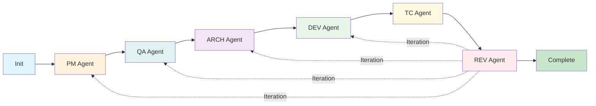

# AI Agent Workflow System - Todo-Driven Development with SDD (Spec-Driven Development)

## Language Configuration

### Document Language Setting
Set the language for all SDD (Spec-Driven Development) workflow documents by configuring the WORKFLOW_LANGUAGE setting:

```
WORKFLOW_LANGUAGE: ko  # Korean (한국어)
```

Available language codes:
- `en` - English (Default)
- `ko` - Korean (한국어)
- `ja` - Japanese (日本語)
- `zh` - Chinese (中文)
- `es` - Spanish (Español)
- `fr` - French (Français)
- `de` - German (Deutsch)
- `pt` - Portuguese (Português)
- `ru` - Russian (Русский)
- `ar` - Arabic (العربية)
- `hi` - Hindi (हिन्दी)
- `it` - Italian (Italiano)

**Note**: All workflow documents (todos, specifications, test cases, architecture docs) will be generated in the specified language. Code comments and variable names remain in English for international compatibility.

## Overview

This project implements a comprehensive AI Agent Workflow system based on Todo-Driven Development (TDD) methodology with Spec-Driven Development (SDD) principles. Every agent begins with creating a detailed todo that defines AS-IS and TO-BE states, ensuring clear objectives and traceability throughout the development lifecycle.

## Core Philosophy

### Todo-First Approach
Every workflow agent starts with creating a structured todo document that:
- Clearly defines the current state (AS-IS)
- Specifies the target state (TO-BE)
- Lists concrete tasks with references
- Provides validation criteria
- Enables new team members to understand and contribute immediately

### Workflow-Centric Design
Each workflow step uses specialized AI agents that adopt specific role personas to provide focused expertise for that development task.

## Workflow Agents

### Agent Workflow Overview Diagram



### 1. Initialize → 2. PM Agent → 3. QA Agent → 4. ARCH Agent → 5. DEV Agent → 6. TC Agent → 7. REV Agent

Each agent:
- Creates an agent-specific todo template (overwrites any existing todo for that agent)
- Adopts the appropriate role persona for that workflow step
- Produces required deliverables
- Validates completion criteria

### Agent-Based Workflow

The SDD (Spec-Driven Development) workflow uses specialized agents instead of commands. Each agent is invoked through Claude Code's Task tool and automatically adopts the appropriate role for that workflow step.

**How to use agents:**
- Instead of typing commands, simply describe what you want to do and Claude Code will invoke the appropriate agent
- Each agent maintains specialized functionality for its role
- Agents can be configured with different AI models for optimal performance
- **Agent Collaboration**: Agents automatically coordinate with each other using the Task tool when issues arise (e.g., specification mismatches, technical constraints, test failures)

### Agent Workflow Steps

#### `/sdd-init` - Project Initialization
Initializes project structure and prepares for todo-driven development. Automatically analyzes existing projects and creates appropriate workflow structure.
```
/sdd-init [project-name]
```
- **Existing Projects**: Analyzes codebase to detect major features and suggests appropriate folder structure
- **New Projects**: Creates basic project structure; first PM Agent invocation will create the initial feature folder
- Creates universal structure adapted to your project type (web, mobile, API, library, etc.)

#### PM Agent - Requirements & Specifications (sdd-pm)
Uses the sdd-pm agent to adopt the PM (Product Manager) role and create requirements following SDD (Spec-Driven Development) principles.

**Usage:** When you describe a feature you want to build, Claude Code will invoke the sdd-pm agent.

**Examples:**
- "I need to build a user authentication system" → Agent creates `sdd/spec/auth/`
- "We need payment processing with Stripe" → Agent creates `sdd/spec/payment/`
- "Add product verification with QR codes" → Agent creates `sdd/spec/verification/`

**Output:** `sdd/spec/[auto-detected-feature]/` - Requirements, user stories, and specifications

#### QA Agent - Test Case Documentation (sdd-qa)
Uses the sdd-qa agent to adopt the QA (Quality Assurance) role and create test documentation based on SDD specifications.

**Usage:** After specifications are complete, request test case creation and Claude Code will invoke the sdd-qa agent.

**Examples:**
- "Create test cases for the auth feature"
- "I need test documentation"
- "What's the next step?" (after PM Agent completion)

**Features:**
- Automatically detects the most recent or active feature
- If multiple features exist, prompts for selection
- Input: Requires completed specifications
- Output: `sdd/qa/[feature]/` - Test cases, test matrix, and UAT scenarios

#### ARCH Agent - System Architecture & Design (sdd-arch)
Uses the sdd-arch agent to adopt the ARCH (Architect) role and design system architecture following SDD principles.

**Usage:** After PM Agent and QA Agent work, request architecture design and Claude Code will invoke the sdd-arch agent.

**Examples:**
- "Design the architecture for this feature"
- "Create the technical design"
- "I need API and database design"

**Features:**
- Automatically detects the active feature
- Makes all technical decisions (frameworks, databases, etc.)
- Input: Requires completed PM Agent and QA Agent work
- Output: `sdd/arch/[feature]/` - Architecture diagrams, API specs, DB design

#### DEV Agent - Implementation & Development (sdd-dev)
Uses the sdd-dev agent to adopt the DEV (Developer) role and implement code strictly according to SDD specifications.

**Usage:** After ARCH Agent is complete, request implementation and Claude Code will invoke the sdd-dev agent.

**Examples:**
- "Implement the authentication feature"
- "Build the code based on the design"
- "Time to write the actual code"

**Features:**
- Implements exactly what's specified, nothing more
- Follows the architecture from ARCH Agent
- Input: Requires completed PM Agent, QA Agent, and ARCH Agent work
- Output: Working code that meets specifications

#### TC Agent - Test Code Implementation (sdd-tc)
Uses the sdd-tc agent to adopt the TC (Test Code) role and create automated tests based on SDD test documentation.

**Usage:** After DEV Agent is complete, request test automation and Claude Code will invoke the sdd-tc agent.

**Examples:**
- "Create automated tests for this feature"
- "Write test code based on the QA docs"
- "Implement the test suite"

**Features:**
- Converts manual test cases to automated tests
- Uses appropriate mocking for dependencies
- **MANDATORY DEV Agent collaboration** when test suite fails
- **Zero failures requirement** - work incomplete until full test suite passes
- Input: Requires QA documentation and built code
- Output: Test code in project locations (`__tests__/`, `test/`, `spec/`)

**Critical Requirements:**
- Must ensure complete test suite passes with ZERO failures
- When individual tests pass but suite fails, MUST call DEV Agent for resolution
- Cannot complete work while collaboration is in progress

#### REV Agent - Specification Validation (sdd-rev)
Uses the sdd-rev agent to adopt the REV (Reviewer) role and validate deliverables against SDD specifications.

**Usage:** After all agents are complete, request review and Claude Code will invoke the sdd-rev agent.

**Examples:**
- "Review the implementation against specs"
- "Validate all deliverables"
- "Check if everything meets requirements"

**Features:**
- Validates all outputs against original specifications
- Identifies gaps or deviations
- Input: All previous agent outputs
- Output: Validation report and compliance documentation

### Utility Functions

#### Status Check - Workflow Progress
Claude Code can show the current progress across all features and agents.

**Usage:** Simply ask about the project status.

**Examples:**
- "What's the current status?"
- "Show me the workflow progress"
- "Which features are in progress?"

**Features:**
- Automatically detects all features in the project
- Displays progress for each feature and agent
- Shows active todos and recommended next actions
- Ask follow-up questions for more details

## Todo Structure

Every agent creates a todo with this structure:

```markdown
# [Agent] Todo - [Project/Feature Name]

## Context
- Agent: [Current agent]
- Date: [Creation date]
- Prerequisites: [Links to dependencies]
- References: [Related documents]

## AS-IS (Current State)
[Clear description of current situation]

## TO-BE (Target State)
[Specific goals and success criteria]

## Tasks
- [ ] Task 1: [Specific action]
  - Reference: [Document/code link]
  - Assigned: [Agent/person]
- [ ] Task 2: ...

## Validation Criteria
- [ ] [How to verify completion]
- [ ] [Quality standards met]
```

## AI Agent Roles

The SDD (Spec-Driven Development) workflow uses specialized agents that adopt different role personas:

### Primary Roles (Mapped to Agents)

#### PM (Product Manager Role) → sdd-pm agent
- Starts with MINIMAL requirements that directly address user needs
- Actively asks users before adding ANY features beyond their request
- Focuses on cost-effectiveness: $10 solution for 1000 users, not $10B
- Creates specifications that match EXACTLY what users asked for
- If additional features seem beneficial, ALWAYS asks user first
- Documents only explicitly requested features, nothing more
- Core value: Maximum user satisfaction with minimal resources
- Follows "Build to Specification Only" principle strictly
- Does NOT make technical architecture decisions
- NEVER creates or modifies stack.md (ARCH role responsibility)
- When users mention technologies, records them as business constraints only
- Example: User says "Firebase" → PM writes "Must use Firebase service (constraint)"
- NEVER chooses frameworks, libraries, or implementation approaches

#### QA (Quality Assurance Role) → sdd-qa agent
- Creates test case documentation based on specifications
- Focuses on WHAT to test and HOW to test manually
- Documents test scenarios that new team members can execute
- Defines test objectives, actions, and expected results
- Creates UAT scenarios and test data specifications

#### ARCH (Architect Role) → sdd-arch agent
- Designs high-level system architecture
- Focuses on project-wide design decisions
- Creates API specifications and database design
- Establishes architectural patterns and guidelines
- Does NOT handle low-level implementation details
- Makes all technical decisions (tech stack, frameworks, databases)
- Creates the initial architecture based on requirements

#### DEV (Developer Role) → sdd-dev agent
- Implements code based on specifications and architecture
- Follows patterns established by ARCH
- Creates working software that meets requirements
- Integrates with existing systems
- Handles detailed implementation decisions

#### TC (Test Code Role) → sdd-tc agent
- Implements automated tests based on QA test cases
- Uses mocking for external dependencies
- Validates business logic and rules
- Removes meaningless tests that only test mocks
- Ensures tests provide real value

#### REV (Reviewer Role) → sdd-rev agent
- Validates all deliverables against specifications
- Identifies gaps between requirements and implementation
- Ensures all requirements are fulfilled
- Documents compliance and deviations

## Role Responsibility Matrix

| Role | Agent | Focus | Creates | Validates |
|------|-------|--------|---------|----------|
| PM | sdd-pm | Business Requirements | - Requirements documentation<br>- User stories | User needs are captured |
| QA | sdd-qa | Test Documentation | - Test case documentation<br>- Test matrix<br>- Test data specs<br>- UAT scenarios | All requirements testable |
| ARCH | sdd-arch | System Design | - High-level architecture<br>- Architecture diagrams<br>- API specifications<br>- Database design<br>- Tech decisions (ADRs) | Design meets requirements |
| DEV | sdd-dev | Implementation | - Working code<br>- Feature implementation<br>- Integration with systems | Code meets specifications |
| TC | sdd-tc | Test Code | - Unit test code<br>- Integration test code<br>- Test fixtures<br>- Coverage config | Tests validate logic |
| REV | sdd-rev | Specification Validation | - Validation report<br>- Gap analysis<br>- Stakeholder approval | All requirements met |

## Agent Output Mapping

| Agent | Output Location | File Types | Notes |
|-------|----------------|------------|-------|
| sdd-pm | `sdd/spec/[feature]/` | `.md` files | Requirements and specifications |
| sdd-qa | `sdd/qa/[feature]/` | `.md` files | Test documentation only |
| sdd-arch | `sdd/arch/[feature]/` | `.md` files | Architecture documentation |
| sdd-dev | `src/` or project structure | Code files | Follows project conventions |
| sdd-tc | `__tests__/`, `test/`, `spec/` | Test code | Location varies by project |
| sdd-rev | `sdd/review/[feature]/` | `.md` files | Validation and approval docs |

**Important**: `sdd` is a folder for Spec-Driven Development documents, NOT a command. There is no `/sdd` command.

## Feature Detection & Management

### Automatic Feature Detection
The workflow system automatically analyzes user requests to determine appropriate feature folders:

- **Natural Language Processing**: AI analyzes the core domain of your request
- **Smart Naming**: Creates concise, meaningful feature names (e.g., `auth`, `payment`, `verification`)
- **Context Awareness**: Subsequent commands detect the active feature from previous work
- **No Manual Specification**: No need to specify feature names in commands

### Examples of Feature Detection
| User Request | Detected Feature | Created Folder |
|--------------|------------------|----------------|
| "Build user authentication" | auth | `sdd/spec/auth/` |
| "Implement payment processing" | payment | `sdd/spec/payment/` |
| "Create product verification system" | verification | `sdd/spec/verification/` |
| "Add shopping cart functionality" | cart | `sdd/spec/cart/` |
| "Build notification service" | notifications | `sdd/spec/notifications/` |

### Working with Multiple Features
- Each feature is developed independently through the workflow agents
- `/sdd-status` shows progress across all features
- Agents automatically detect the most recent or relevant feature
- When ambiguous, the system prompts for clarification

## Context Management

### Overview
The workflow system maintains a living knowledge base in `sdd/context/` that grows throughout the project lifecycle. Each workflow agent has the responsibility to update relevant context files when new information is discovered.

### Context Files
- **`sdd/context/project.md`**: Project overview, goals, stakeholders, and evolving understanding
- **`sdd/context/stack.md`**: Technology decisions, dependencies, and infrastructure choices
- **`sdd/context/patterns.md`**: Coding patterns, architectural decisions, and conventions

### Update Responsibilities by Role

| Role | Agent | Updates | When to Update |
|------|-------|---------|----------------|
| PM | sdd-pm | project.md ONLY | When discovering requirements, stakeholders, or constraints |
| QA | sdd-qa | project.md | When identifying quality standards or compliance needs |
| ARCH | sdd-arch | stack.md, patterns.md | When making technology or design decisions |
| DEV | sdd-dev | stack.md, patterns.md | When adding dependencies or establishing patterns |
| TC | sdd-tc | stack.md, patterns.md | When choosing test frameworks or patterns |
| REV | sdd-rev | Reviews all files | Validates consistency and completeness |

### Best Practices
1. **Update Immediately**: When discovering important information, update context files right away
2. **Be Specific**: Document decisions with rationale, not just outcomes
3. **Keep Current**: Context files should reflect the latest understanding
4. **Version Control**: Context files are part of the project and should be committed

## Getting Started

### Quick Start

1. **Initialize your project**
   ```
   /sdd-init my-awesome-project
   ```

2. **Start specifications (PM role)**
   - Say: "I need to build a user authentication system"
   - Claude Code invokes sdd-pm agent → Creates `sdd/spec/auth/`

3. **Create test documentation (QA role)**
   - Say: "Create test cases" or "What's next?"
   - Claude Code invokes sdd-qa agent → Creates `sdd/qa/auth/`

4. **Design architecture (ARCH role)**
   - Say: "Design the architecture"
   - Claude Code invokes sdd-arch agent → Creates `sdd/arch/auth/`

5. **Build implementation (DEV role)**
   - Say: "Implement the feature"
   - Claude Code invokes sdd-dev agent → Creates working code

6. **Create test code (TC role)**
   - Say: "Create automated tests"
   - Claude Code invokes sdd-tc agent → Creates test code

7. **Final review (REV role)**
   - Say: "Review everything"
   - Claude Code invokes sdd-rev agent → Validates deliverables

8. **Check status anytime**
   - Say: "What's the current status?"
   - Shows progress for all features

### Project Structure

#### Standard Structure (Created by /sdd-init)
```
project/
├── sdd/            # Spec-Driven Development documents
│   ├── todos/      # Agent-specific todo files (created by SDD agents)
│   │   ├── todo-spec.md    # Created by sdd-pm agent
│   │   ├── todo-qa.md      # Created by sdd-qa agent
│   │   ├── todo-design.md  # Created by sdd-arch agent
│   │   ├── todo-build.md   # Created by sdd-dev agent
│   │   ├── todo-test.md    # Created by sdd-tc agent
│   │   └── todo-review.md  # Created by sdd-rev agent
│   ├── context/    # Project context (auto-generated)
│   │   ├── project.md    # Project overview
│   │   ├── stack.md      # Technology stack
│   │   └── patterns.md   # Discovered patterns
│   └── WORKFLOW.md # Workflow status tracker
└── [your project files]
```

#### Working Structure (Created during workflow)
**Note**: Directory structure is created progressively as each agent executes. Features are automatically detected from your requests.
```
project/
├── sdd/            # Spec-Driven Development documents
│   ├── todos/      # Agent-specific todo files (single file per agent)
│   │   ├── todo-spec.md
│   │   ├── todo-qa.md
│   │   ├── todo-design.md
│   │   ├── todo-build.md
│   │   ├── todo-test.md
│   │   └── todo-review.md
│   ├── context/    # Project context
│   │   ├── project.md
│   │   ├── stack.md
│   │   └── patterns.md
│   ├── spec/       # PM specifications (sdd-pm agent creates feature folders)
│   │   ├── [auto-detected-feature-1]/
│   │   │   ├── requirements.md
│   │   │   └── user-stories.md
│   │   └── [auto-detected-feature-2]/
│   │       └── ...
│   ├── qa/         # QA test cases (sdd-qa agent creates feature folders)
│   │   └── [features created as needed]/
│   │       ├── test-cases.md
│   │       ├── test-matrix.md
│   │       ├── test-data.md
│   │       └── uat-scenarios.md
│   └── arch/       # Architecture design (sdd-arch agent creates feature folders)
│       └── [features created as needed]/
│           ├── architecture.md
│           ├── api-spec.md      # If applicable
│           ├── db-design.md     # If applicable
│           └── tech-decisions.md
├── src/            # Implementation code (sdd-dev agent)
│   └── [feature implementation]
├── __tests__/      # Test code (sdd-tc agent) - location varies by project
│   └── [test implementation]
└── [other project files]
```

**Note**: The workflow system creates a universal structure that adapts to your project type. The `sdd/` directory contains all Spec-Driven Development documents and workflow files. Implementation code and test code are placed in project-appropriate locations (e.g., `src/`, `__tests__/`, `test/`, `spec/`) following the project's existing conventions.

**Important**: 
- `sdd/` stands for "Spec-Driven Development" and is a directory, not a command. There is no `/sdd` command in the workflow system.
- The structure automatically adapts based on project type - mobile apps won't have unnecessary web-specific docs, libraries focus on API documentation, etc.
- Use feature names for folders (e.g., `auth`, `payment`, `verification`), NOT project names
- Group related functionality together to maintain clear organization

## Best Practices

### 1. Always Start with Todo
Never skip todo creation. It provides:
- Clear objectives
- Traceability
- Onboarding for new members
- Progress tracking

### 2. Complete AS-IS/TO-BE Definition
Be specific about:
- Current problems or limitations
- Desired outcomes
- Success metrics
- Constraints

### 3. Reference Everything
Every task should include:
- Links to relevant documents
- Code locations
- External resources
- Decision rationale

### 4. Validate Before Proceeding
Each agent must:
- Complete all todo tasks
- Meet validation criteria
- Get necessary approvals
- Document learnings

### 5. Iterate When Needed
The workflow supports iteration:
- REV Agent can trigger returns to earlier agents
- Todos track iteration history
- Continuous improvement is encouraged

## Quality Gates

Recommended quality checks between agents (manually enforced):
- **PM Agent → QA Agent**: Requirements completeness
- **QA Agent → ARCH Agent**: Test scenarios coverage
- **ARCH Agent → DEV Agent**: Technical feasibility
- **DEV Agent → TC Agent**: Code quality and coverage
- **TC Agent → REV Agent**: All tests passing
- **REV Agent → Done**: Stakeholder approval

## Success Metrics

- **Efficiency**: 30-50% faster development
- **Quality**: 40%+ fewer defects
- **Documentation**: 100% coverage
- **Traceability**: Complete audit trail
- **Onboarding**: New members productive in hours

## Important Notes

1. **Agent-Based System**: The SDD (Spec-Driven Development) workflow now uses specialized agents (sdd-pm, sdd-qa, sdd-arch, sdd-dev, sdd-tc, sdd-rev) that are invoked automatically by Claude Code based on your requests.

2. **No Direct Commands**: Instead of typing commands, simply describe what you want to do and Claude Code will invoke the appropriate agent.

3. **Directory Creation**: Agents create only the directories they need. Additional directories are created progressively as you work through the agents.

4. **Todo Overwrite Policy**: Each agent creates a fresh todo for its role, overwriting any previous version to ensure clarity and prevent confusion.

5. **Workflow State Management**: The workflow state is tracked through:
   - Todo files completion status
   - Git commit history
   - File timestamps
   - Natural progression through agents

6. **Model Selection**: Each agent can use different AI models (opus, sonnet, etc.) for optimal performance and cost efficiency.

7. **Automatic Context**: Agents automatically detect the active feature and context from previous work.

## Troubleshooting

### Common Issues

**"No active todo found"**
- Request the appropriate agent (e.g., "Create specifications")
- Check sdd/todos/ directory for existing files

**"Agent prerequisites not met"**
- Complete previous agents first
- Check validation criteria in previous todo

**"Agent not invoked"**
- Be more specific about what you want (e.g., "I need to build an auth system")
- Mention the role explicitly (e.g., "Create test cases")

**"Agent failed to complete task"**
- Review agent output for errors
- Check references and context
- Provide more details about your requirements

## Agent Reference

### Initialization
- `/sdd-init` - Initialize project structure (still a direct command)

### SDD Workflow Agents (Invoked Automatically)
- **sdd-pm** - Create requirements and specifications (PM role)
  - Triggered by: "I need to build...", "Create specs for...", "Start a new feature..."
- **sdd-qa** - Create test case documentation (QA role)
  - Triggered by: "Create test cases", "Document tests", "What's next?" (after PM Agent)
- **sdd-arch** - Create architecture and design (ARCH role)
  - Triggered by: "Design the architecture", "Create technical design"
- **sdd-dev** - Implement software (DEV role)
  - Triggered by: "Implement the feature", "Build the code", "Start coding"
- **sdd-tc** - Create automated tests (TC role)
  - Triggered by: "Create automated tests", "Write test code"
- **sdd-rev** - Specification validation (REV role)
  - Triggered by: "Review the implementation", "Validate deliverables"

### Utility Functions
- **Status Check** - Show workflow progress
  - Triggered by: "What's the status?", "Show progress", "Where are we?"

### Sub-Agent Coordination Protocols

All SDD workflow agents can call other agents using the Task tool when collaboration is needed:

#### Common Collaboration Patterns
- **ARCH → DEV**: Technical feasibility validation for architecture decisions
- **ARCH → PM**: Requirements clarification for design decisions  
- **ARCH → QA**: Testability validation for proposed architecture
- **TC → DEV**: Implementation fixes for test failures (MANDATORY)
- **DEV → PM**: Requirements clarification during implementation
- **DEV → ARCH**: Architecture constraints during implementation
- **DEV → QA**: Test case alignment during implementation
- **QA → PM**: Requirements clarification for test cases
- **QA → ARCH**: System understanding for test planning
- **REV → [ANY]**: Issue resolution for specification compliance

#### Using Task Tool for Agent Coordination
When an agent needs to consult another agent, use the Task tool with the following pattern:

```
Task tool parameters:
- subagent_type: "[target-agent]" (e.g., "sdd-dev", "sdd-pm", "sdd-qa", "sdd-arch", "sdd-rev")
- description: "[Brief description of consultation need]"
- prompt: "[Detailed consultation request with context and specific questions]"
```

#### Critical Rules for Agent Coordination
1. **Always Use Task Tool**: Don't just mention coordination - actually invoke the tool
2. **Provide Complete Context**: Include specification references and detailed problem descriptions
3. **Wait for Response**: Don't proceed until consultation is complete
4. **Document Outcomes**: Update relevant files with consultation results
5. **Iterative Consultation**: Repeat consultation if initial response doesn't resolve the issue
6. **Mandatory Collaboration**: Some scenarios require collaboration (e.g., TC Agent MUST call DEV Agent for test failures)

#### TC Agent Special Requirements
The TC (Test Code) Agent has enhanced collaboration requirements:
- **MANDATORY DEV Agent Consultation**: When test suite fails but individual tests pass
- **Zero Test Failures Rule**: Work is NOT complete until full test suite shows ZERO failures
- **Specification Compliance First**: Always verify specification compliance before making changes
- **Complete Collaboration**: Work cannot be marked complete while collaboration is in progress

## Support

For issues or questions:
- Check `/sdd-status` for current state
- Review agent-specific todo
- Analyze complex issues with available tools
- Consult team leads for workflow questions

Remember: **Every journey begins with a single todo.** Start with `/sdd-init` and let the workflow guide you to successful delivery!

## SDD (Spec-Driven Development) Workflow Core Principles

### Specification-Based Development
The SDD (Spec-Driven Development) workflow follows specification-based development principles to prevent over-engineering:

1. **Build to Specification Only**: Implement exactly what is specified in requirements, nothing more
2. **No Preemptive Solutions**: Do not anticipate or solve problems that are not explicitly stated in specifications
3. **Simplicity First**: Choose the simplest solution that meets the specification requirements
4. **User-Driven Complexity**: Only add complexity when explicitly requested by the user
5. **Ask Before Assuming**: If something seems necessary but isn't in the spec, ask the user first

**CRITICAL FOR PM ROLE**: The PM must be the guardian of minimal specifications. Every additional feature is a cost. The PM's excellence is measured by achieving user satisfaction with minimal features, not by comprehensive feature lists.

### Key Guidelines
- **Focus on User Value**: Products are built for users, not for showcasing technical sophistication
- **Avoid Creating Problems**: Don't identify and fix "problems" that aren't actual problems
- **Specification Compliance**: Meeting specifications is the primary goal, not exceeding them
- **Active Communication**: When in doubt about scope, actively ask users to clarify specifications
- **No Unauthorized Additions**: Any addition beyond specifications violates our core principles

### Examples
- ❌ Bad: "I'll add caching for better performance" (not in spec)
- ✅ Good: "The spec doesn't mention caching. Should we add it?"
- ❌ Bad: "I'll implement error handling for edge cases" (not specified)
- ✅ Good: "The spec covers happy path. Do you want error handling?"
- ❌ Bad (PM): "I'll add statistics and reporting features" (user didn't ask)
- ✅ Good (PM): "You asked for verification. Would you also like statistics?"
- ❌ Bad (PM): "I'll include user management and roles" (expanding scope)
- ✅ Good (PM): "The core need is product verification. Is that correct?"

Remember: Simplicity and specification compliance are our core values. Complexity without user agreement is a violation of specification-based development.